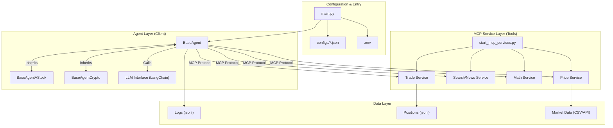

# AI-Trader 代码仓库架构分析

## 1. 项目目录结构

该项目采用了**Agent核心与工具服务分离**的结构设计，主要目录功能如下：

### 核心逻辑层 (`agent/`)
*   存放交易Agent的核心实现。
*   `base_agent/`: 通用Agent基类 (`BaseAgent`)，封装了LLM交互、MCP工具调用、状态管理等基础能力。
*   `base_agent_astock/`: 针对A股市场的扩展实现 (`BaseAgentAStock`)。
*   `base_agent_crypto/`: 针对加密货币市场的扩展实现 (`BaseAgentCrypto`)。
*   包含不同时间粒度的实现（如 `_hour` 后缀文件）。

### 工具服务层 (`agent_tools/`)
*   基于 **Model Context Protocol (MCP)** 的工具集。
*   `start_mcp_services.py`: MCP服务启动脚本，负责编排和运行各个工具服务。
*   `tool_*.py`: 具体的工具实现，如 `tool_trade.py` (交易), `tool_math.py` (计算), `tool_alphavantage_news.py` (搜索/新闻)。

### 配置层 (`configs/`)
*   JSON格式的配置文件，驱动系统行为。
*   定义了Agent类型、使用的模型 (Claude, GPT, DeepSeek等)、市场类型 (US, CN, Crypto) 及回测/实盘参数。

### 数据持久层 (`data/`)
*   `A_stock/`: 静态或历史行情数据。
*   `agent_data/` & `agent_data_astock/`: 运行时数据，按模型分目录存储。
    *   `log/`: 详细的决策日志 (`log.jsonl`)。
    *   `position/`: 每日持仓状态 (`position.jsonl`)。

### 根目录关键文件
*   `main.py`: 主程序入口，负责加载配置、实例化Agent并运行。
*   `requirements.txt`: Python依赖定义。
*   `.env`: 环境变量（API Keys, 端口配置）。

## 2. 技术架构

### 核心语言与框架
*   **Python 3**: 主要开发语言。
*   **LangChain**: 用于构建Agent，管理LLM交互、Prompt模板及工具调用链。
*   **FastMCP / LangChain-MCP-Adapters**: 实现了 **Model Context Protocol (MCP)**，将工具解耦为独立服务。

### 模块划分与依赖
*   **Control Plane (Agent)**: 由 `BaseAgent` 及其子类构成。它不直接执行交易，而是通过MCP Client发送指令。
*   **Tool Plane (MCP Services)**: 独立的HTTP服务 (Math, Search, Trade, Price)，通过 `.env` 配置端口。
*   **Data Plane**: 依赖 `pandas` 处理数据，文件系统 (JSONL) 持久化状态。

### 数据流和控制流设计
1.  **初始化**: `main.py` 读取 `config.json` -> 动态加载对应的 `Agent` 类。
2.  **思考循环**: Agent 获取当前状态 -> 构建 Prompt -> 调用 LLM。
3.  **工具执行**: LLM 返回工具调用请求 -> Agent 通过 MCP Client 转发给 `agent_tools` 服务 -> 服务执行并返回结果。
4.  **状态更新**: 交易工具 (`tool_trade.py`) 更新 `position.jsonl`，并通过文件锁 (`.position.lock`) 保证并发安全。

## 3. 构建与部署

### 编译/打包工具链配置
*   **环境管理**:
    *   依赖管理：`requirements.txt`。
    *   配置管理：`.env` 文件管理敏感信息（API Key）和基础设施配置（端口）。

### 持续集成/部署流程
*   **运行机制**:
    *   **多进程架构**: 工具层通过 `start_mcp_services.py` 作为独立进程组运行；Agent层作为客户端进程运行。
    *   支持并行运行：`main_parrallel.py` 暗示了支持多Agent并发运行的能力。

## 4. 代码组织原则

### 模块化设计思路
*   **继承多态**: 通过 `BaseAgent` -> `BaseAgentAStock` 的继承链，实现了通用逻辑复用和特定市场逻辑的隔离。
*   **依赖倒置**: Agent 不直接依赖工具代码，而是通过 MCP 协议接口进行交互。

### 公共组件复用机制
*   `tools/general_tools.py`: 通用配置读取、日志处理。
*   `tools/price_tools.py`: 行情获取逻辑被多个模块共享。

## 5. 扩展性设计

### 插件/扩展点设计
*   **新工具**: 只需在 `agent_tools/` 添加脚本并在 `start_mcp_services.py` 注册，无需修改Agent核心代码。
*   **新模型**: 在 `configs/` 中添加模型配置即可，Agent代码已适配多种LLM格式 (如 DeepSeek 特殊处理)。
*   **新策略/市场**: 继承 `BaseAgent` 实现新的子类，并在 `main.py` 的 `AGENT_REGISTRY` 中注册。

### 配置化能力
*   高度配置驱动，从交易标的、资金量到使用的模型版本均完全由 JSON 配置控制，便于实验对比。

## 架构示意图

## 特殊设计决策说明

1.  **采用 MCP (Model Context Protocol)**:
    *   **背景**: 传统的函数调用通常与Agent代码紧耦合。
    *   **决策**: 使用MCP将工具独立为服务。这允许工具独立开发、部署，甚至可以用不同语言编写，且能被不同的Agent复用。

2.  **文件锁机制 (`_position_lock`)**:
    *   **背景**: 本地运行多个Agent模型进行对比实验时，可能会同时读写持仓文件。
    *   **决策**: 在 `tool_trade.py` 中使用文件锁，确保多进程并发写入时的主要数据一致性，避免数据库的重型依赖。

3.  **动态类加载 (`AGENT_REGISTRY`)**:
    *   **背景**: 需要灵活切换不同的市场和策略。
    *   **决策**: 在 `main.py` 中使用注册表模式，根据配置字符串动态实例化类，实现了配置即代码的灵活性。
